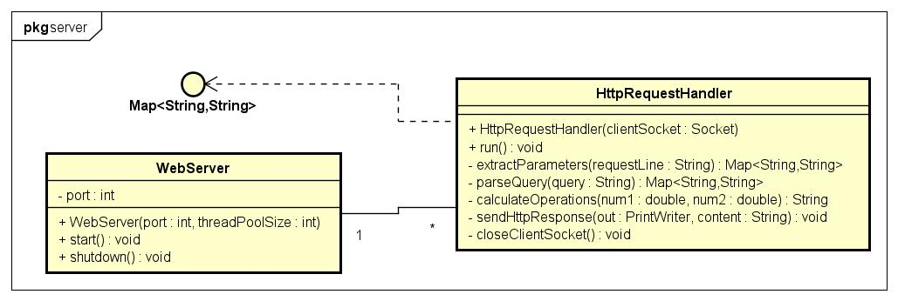

# MultiThreaded Web Server - Calculadora HTTP

# Descrição

    Este é um projeto de servidor web multi-threaded simples em Java, que recebe dois valores numéricos como parâmetros de uma requisição HTTP e retorna os resultados das quatro operações matemáticas básicas: soma, subtração, multiplicação e divisão. O servidor é capaz de lidar com múltiplas conexões simultâneas, utilizando um pool de threads.

# Estrutura do Projeto
    É possível compreender toda estrutura deste projeto através do diagrama UML de classes a seguir:

   

1. Enviando uma Requisição

    Você pode enviar uma requisição HTTP ao servidor de várias maneiras:

    Usando o navegador:http://localhost:8080?num1=10&num2=5

    Usando curl no terminal:curl "http://localhost:8080?num1=10&num2=5"

    Usando uma ferramenta como o Postman.

2. Exemplo de Resposta

    Quando você acessa a URL http://localhost:8080?num1=10&num2=5, o servidor retorna a seguinte resposta no corpo da requisição:

    Resultados das Operações:

    Soma: 15.0

    Subtração: 5.0

    Multiplicação: 50.0

    Divisão: 2.0

    Se num2 for 0, a resposta incluirá uma mensagem de erro indicando que a divisão por zero não é possível.

3. Exemplo de Erro
Caso os parâmetros num1 ou num2 estejam ausentes, o servidor retorna:

arduino
Copiar código
Parâmetros 'num1' e 'num2' são obrigatórios na URL.
Como Rodar o Projeto
1. Pré-requisitos
Java: Certifique-se de ter o JDK 8 ou superior instalado.
Compilador Java: Você pode compilar o projeto diretamente pela linha de comando.
2. Compilar o Projeto
Navegue até o diretório raiz do projeto e compile os arquivos Java:

bash
Copiar código
javac -d bin src/server/*.java src/Main.java
3. Executar o Servidor
Após a compilação, você pode iniciar o servidor executando o seguinte comando:

bash
Copiar código
java -cp bin Main
O servidor começará a escutar na porta 8080 para conexões HTTP.

4. Enviando Requisições
Após o servidor ser iniciado, você pode abrir um navegador, usar o curl ou o Postman para enviar requisições ao servidor conforme descrito acima.

Customizações
Você pode alterar a porta em que o servidor escuta modificando a linha correspondente no arquivo Main.java:

java
Copiar código
WebServer server = new WebServer(8080, 4);
Aqui, o primeiro argumento (8080) é o número da porta, e o segundo argumento (4) é o tamanho do pool de threads.

Tecnologias Utilizadas
Java: Linguagem de programação principal do projeto.
Sockets: Para comunicação entre o servidor e os clientes.
Multi-threading: Para permitir que múltiplos clientes se conectem ao servidor simultaneamente.
Melhorias Futuras
Implementar suporte para outros métodos HTTP além de GET.
Adicionar suporte para operações mais complexas (ex: potências, raízes).
Criar uma interface web para facilitar a interação com o servidor.
Contribuições
Contribuições são bem-vindas! Sinta-se à vontade para abrir issues ou enviar pull requests.